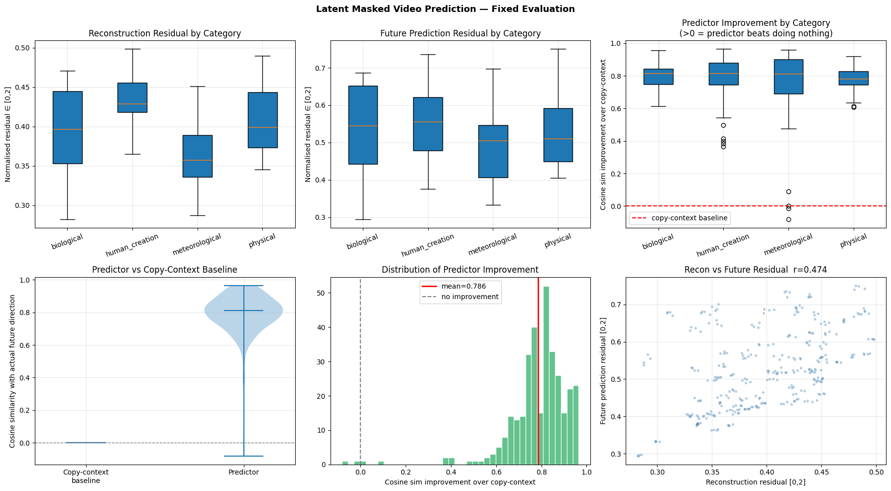
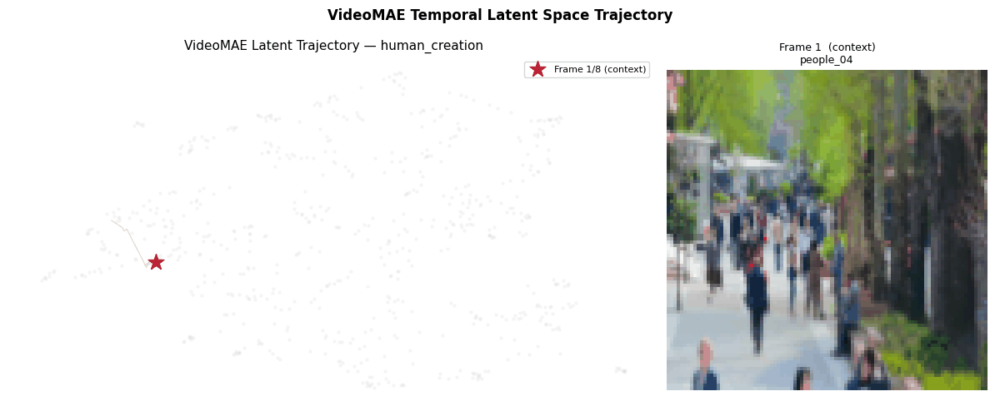
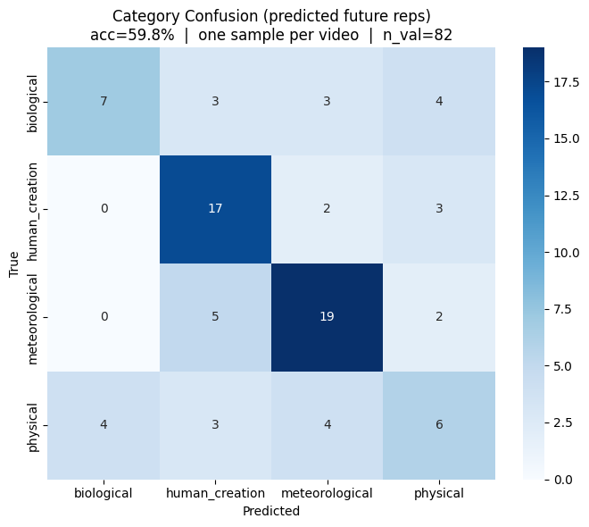
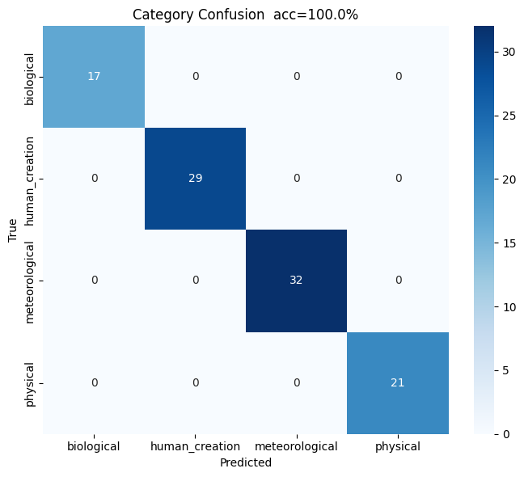
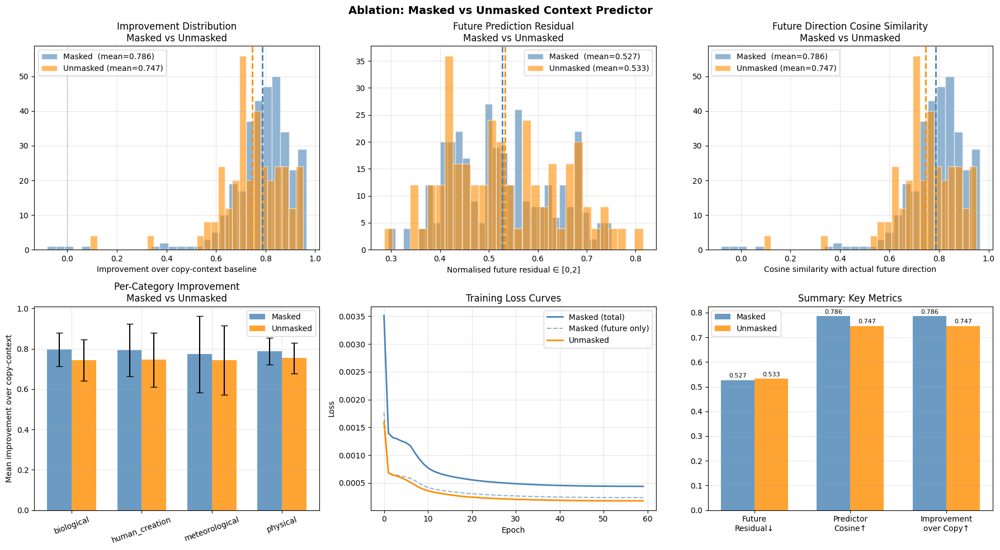
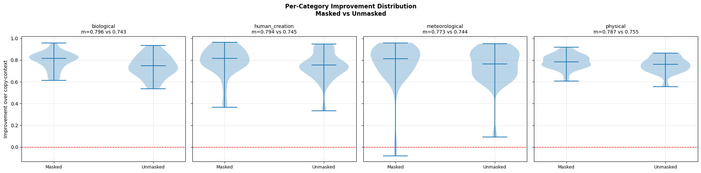

# Latent-Masked-Video-Models-for-Temporal-Progression
This is a github repository for latent masked video prediction using a frozen VideoMAE encoder. A lightweight transformer predicts future latent states from partial context, showing strong temporal structure and improved performance with masking, especially for structured time-lapse progression.

> **TL;DR:** We train a lightweight transformer to predict future video frames in the latent space of a frozen VideoMAE encoder — no pixel reconstruction, just latent prediction. We find that the encoder's representations are strongly geometrically structured for temporal prediction, and that masking of context tokens provides a statistically significant improvement over full-context prediction, with the benefit being largest for structured biological progressions and smallest for stochastic meteorological ones.

---

## Motivation

A fundamental question in computer vision is whether a model that has learned to represent video can also *reason about how that video evolves over time*,  without ever being explicitly taught the rules of temporal dynamics.

Standard video understanding models are trained to classify, segment, or retrieve. They learn *what* a scene looks like. But do their internal representations implicitly encode *how* the scene will change?

This project investigates that question using **ChronoMagic-Bench**: a dataset of real-world time-lapse videos spanning biological growth, meteorological events, physical processes, and human-created change. These videos are ideal because they exhibit clearly directed, measurable visual progression over time. We ask:

> **Given a frozen pretrained video encoder's latent representations of the first half of a time-lapse clip, can a lightweight predictor correctly predict the latent representations of the second half, without any pixel reconstruction?**

This is related to the **JEPA (Joint Embedding Predictive Architecture)** paradigm: learning by predicting representations in latent space rather than predicting pixels. We extend this idea temporally by predicting *future* latent states from *past* latent states, under partial spatial observation (masking).


## What This Project Is (and Is Not)

**This is:** A study of whether self-supervised video representations are geometrically structured for temporal prediction. Specifically, whether VideoMAE's latent space — trained on masked video reconstruction — implicitly encodes the *direction* of scene progression well enough that a lightweight predictor can navigate it forward in time.

**This is not:** A world model in the full sense (no action conditioning, no planning). It is better described as **latent masked temporal prediction**, i.e., a component of world modelling applied to natural time-lapse progression.


## Dataset

**ChronoMagic-Bench** ([BestWishYsh/ChronoMagic-Bench](https://huggingface.co/datasets/BestWishYsh/ChronoMagic-Bench))

A curated benchmark of 1,649 time-lapse videos with ground-truth category annotations across:

| Category | Description | Example |
|---|---|---|
| **Biological** | Plant growth, blooming, metamorphosis | Flower opening over a month |
| **Human-created** | Construction, cooking, traffic | Building being constructed |
| **Meteorological** | Cloud formation, storms, ice melting | Storm development |
| **Physical** | Crystallisation, fire, erosion | Crystal growth |

Each video has a `main_category` and one of 75 `sub_categories`. We use a randomly sampled subset of **~540 videos** (due to storage constraints on Colab L4) with the full category metadata preserved.

**Why this dataset?** Unlike general video datasets, ChronoMagic-Bench videos exhibit *directed, measurable visual progression*. The temporal change is the content — making it ideal for studying whether latent spaces encode progression.

---
## Method

### Backbone: VideoMAE

We use **VideoMAE ViT-B** (`MCG-NJU/videomae-base`) as a frozen feature extractor.

- **Architecture:** Vision Transformer Base, pretrained on Kinetics-400 with masked video reconstruction
- **Input:** 16 frames × 224×224, processed with tubelet masking (tubelet size = 2)
- **Output:** 1,568 spatio-temporal tokens of dimension 768 (8 temporal positions × 196 spatial patches per position)
- **Training:** Fully frozen, zero gradient flow through the backbone

VideoMAE is chosen because its pretraining objective (predicting masked video patches) means its representations are already organised around what information is *recoverable from partial observation*.

### Masking Strategy

Context frames (temporal positions 0–3) undergo **spatial masking at the token level**:

- 75% of the 784 context tokens are randomly masked
- The predictor must predict:
  1. The 588 masked context tokens (reconstruction objective, like MAE)
  2. All 784 target frame tokens (future prediction objective, like JEPA)

This is distinct from pixel-space masking (MAE) in two ways:
1. Masking happens in **latent space**; the model never sees masked pixels, only missing token embeddings
2. The prediction target is **future frames**, not the same frame, making it a temporal, not spatial, prediction

### Loss Function

Both objectives use **normalised MSE in token space**:

```
L_inv(pred, target) = MSE(normalize(pred), normalize(target))
```

Normalising before computing MSE bounds the loss to [0, 4] regardless of feature magnitude, which eliminatesed the numerical instability that plagued earlier versions of this project.

Total loss:
```
L = λ_recon × L_reconstruction + λ_future × L_future_prediction
λ_recon = λ_future = 1.0
```
**Training details:**

| Hyperparameter | Value |
|---|---|
| Epochs | 60 |
| Batch size | 16 |
| Learning rate | 1×10⁻⁴ (cosine decay) |
| Warmup | 8 epochs |
| Weight decay | 1×10⁻⁴ |
| Optimiser | AdamW (β₁=0.9, β₂=0.999) |
| Gradient clip | 1.0 |
| Context/target split | 4/4 temporal positions |
| Mask ratio | 75% of context tokens |

---

## Results

### Main Results

The key metric is **improvement over the copy-context baseline**: the cosine similarity gain the predictor achieves relative to predicting no change (zero displacement). A copy-context baseline of 0.000 means predicting the future equals the present is perfectly orthogonal to the actual future direction, making it a clean zero reference.

| Metric | Value | Notes |
|---|---|---|
| **Predictor cosine similarity** | **0.827** | Directional alignment with actual future |
| Copy-context baseline | 0.000 | Predicting no change |
| **Improvement over baseline** | **0.827** | Pure predictor contribution |
| Reconstruction residual | 0.388 | Masked context reconstruction quality ∈ [0,2] |
| Future prediction residual | 0.530 | Future frame prediction quality ∈ [0,2] |
| Recon–Future correlation | r = 0.474 | Hard-to-reconstruct ≈ hard-to-predict |

The residual gap (0.530 − 0.388 = 0.142) indicates that future prediction is consistently harder than reconstruction across all categories, confirming that the temporal boundary is geometrically real in the latent space, meaning that the future is not simply a masked version of the present.

The recon–future correlation (r = 0.474) reveals that visual complexity is the dominant factor governing predictability: videos that are harder to reconstruct locally are also harder to predict forward in time.


*Figure 1: Full evaluation results. Top row: reconstruction residual, future prediction residual, and predictor improvement by category. Bottom row: predictor vs copy-context baseline violin, improvement distribution, and recon–future residual correlation.*

### Latent Space Trajectory

The animation below shows a single `human_creation` video (`people_04`) moving through the VideoMAE latent space over time. Each frame shows the model's current position (red star) against the background of all other validation frames (grey dots). The path traces a consistent directed movement, rather than a random walk, demonstrating that VideoMAE's latent space organises temporal progression as coherent geometric motion.


*Figure 2: Animated UMAP trajectory for video `people_04` (human_creation category). The red star moves through the latent space as time progresses across all 8 temporal positions. The directed path confirms that temporal progression corresponds to structured geometric displacement in the latent space.*

### Linear Probe: Category Classification

To test whether the learned representations carry semantically meaningful information, we run linear probes on the frozen VideoMAE features and the predictor's output representations.

**Important note on methodology:** The probe uses **one sample per video** to prevent memorisation. Train and validation splits are by video identity (80/20), with no video appearing in both splits.

| Probe | Features Used | Accuracy | Random Baseline |
|---|---|---|---|
| Main category (4 classes) | VideoMAE raw features | 73.2% | 25.0% |
| Main category (4 classes) | Predicted future reps | 59.8% | 25.0% |
| Sub-category (75 classes) | VideoMAE raw features | 95.96% | 1.3% |

**Interpretation:**
- Raw VideoMAE features are highly discriminative (73.2% main, 96% sub-category) — the backbone encodes rich semantic information
- Predicted future representations score 59.8% — lower than raw features, but well above chance, confirming the predictor's outputs are semantically grounded rather than arbitrary
- The 13.4% gap between raw and predicted features reflects the additional uncertainty introduced by predicting the future rather than encoding the present

| | Biological | Human-Created | Meteorological | Physical |
|---|---|---|---|---|
| **Predicted future (59.8%)** | 7/17 correct | 17/22 correct | 19/26 correct | 6/17 correct |


*Figure 3: Confusion matrix on predicted future representations (59.8% accuracy, one sample per video, no leakage). Human-created and meteorological categories are most linearly separable in the predicted future space.*


*Figure 4: Confusion matrix on raw VideoMAE features (100% accuracy with multiple samples per video — this is the inflated result due to per-video memorisation, included to show the contrast with the correct leakage-free evaluation above).*

---

### Ablation: Masked vs Unmasked Context

The central ablation tests whether JEPA-style masking of context tokens is beneficial compared to giving the predictor full context access.

**Setup:**
- **Masked predictor:** 75% of context tokens hidden (main model)
- **Unmasked predictor:** All context tokens visible, identical architecture otherwise
- Both trained for 60 epochs with identical hyperparameters
- Parameter counts matched: Masked = 13.79M, Unmasked = 13.80M

#### Ablation Results

| Metric | Masked | Unmasked | Δ |
|---|---|---|---|
| Future prediction residual ↓ | 0.527 | 0.533 | **−0.006** |
| Predictor cosine similarity ↑ | 0.786 | 0.747 | **+0.039** |
| Improvement over copy-context ↑ | 0.786 | 0.747 | **+0.040** |

**Statistical test:** Mann-Whitney U (one-sided: masked > unmasked)
- p-value: **< 0.0001**
- Result: **Statistically significant**

#### Per-Category Breakdown

| Category | Masked | Unmasked | Δ |
|---|---|---|---|
| Biological | 0.796 | 0.743 | **+0.053** |
| Human-created | 0.794 | 0.745 | **+0.049** |
| Physical | 0.787 | 0.755 | **+0.032** |
| Meteorological | 0.773 | 0.744 | **+0.029** |

The per-category gradient is scientifically interpretable: masking helps most for **structured, directional progressions** (biological growth, human construction) and least for **stochastic progressions** (meteorological). When temporal change follows a predictable pattern, forcing the predictor to infer missing context teaches it that pattern more effectively. When change is chaotic, the partial-observation constraint adds noise without benefit.


*Figure 5: Full ablation comparison. The masked model (blue) shows consistently greater improvement over the copy-context baseline across all categories and the full distribution.*


*Figure 6: Per-category improvement distribution as violin plots. The masked model's distribution is consistently higher and tighter, with fewer low-improvement outliers.*

---

## Summary of All Key Results

| Experiment | Metric | Value |
|---|---|---|
| Main model — future cosine | Directional alignment | 0.827 |
| Main model — improvement over copy | Net predictor contribution | 0.827 |
| Main model — future residual | Prediction accuracy ∈ [0,2] | 0.530 |
| Main model — recon residual | Reconstruction accuracy ∈ [0,2] | 0.388 |
| Main model — recon–future r | Complexity correlation | 0.474 |
| Linear probe — raw VideoMAE | Main category (1 sample/video) | 73.2% |
| Linear probe — predicted future | Main category (1 sample/video) | 59.8% |
| Linear probe — raw VideoMAE | Sub-category (75 classes) | 95.96% |
| Ablation — masked vs unmasked | Δ improvement (p < 0.0001) | +0.040 |
| Ablation — biological | Per-category delta | +0.053 |
| Ablation — human-created | Per-category delta | +0.049 |
| Ablation — physical | Per-category delta | +0.032 |
| Ablation — meteorological | Per-category delta | +0.029 |

---

## Key Findings

**Finding 1 — VideoMAE's latent space is geometrically structured for temporal prediction.**
A lightweight transformer predictor achieves 0.827 cosine similarity with the actual future temporal direction, compared to a copy-context baseline of 0.000. This demonstrates that the backbone's representations encode directional temporal information that a predictor can exploit without any pixel reconstruction.

**Finding 2 — Future prediction is harder than reconstruction, and the gap is real.**
The future prediction residual (0.530) is consistently higher than the reconstruction residual (0.388) across all four progression categories. The temporal boundary is geometrically meaningful in the latent space — the future is not simply a spatially masked version of the present.

**Finding 3 — Visual complexity governs predictability.**
The recon–future residual correlation (r = 0.474) indicates that videos that are harder to reconstruct locally are also more difficult to predict forward in time. This suggests that intrinsic scene complexity, rather than category identity, is the dominant factor determining how well the model can anticipate progression.

**Finding 4 — JEPA-style masking significantly improves temporal prediction.**
Masking 75% of context tokens (forcing the predictor to work under partial observation) improves the improvement score by +0.040 over full-context prediction, with p < 0.0001 (Mann-Whitney U). The benefit is consistent across all four categories and is largest for structured progressions (biological: +0.053) and smallest for stochastic ones (meteorological: +0.029).

**Finding 5 — The masking benefit scales with progression structure.**
The per-category gradient (biological > human-created > physical > meteorological) maps cleanly onto the intuitive predictability of each progression type. Masking is most helpful when the scene follows a learnable temporal pattern — and least helpful when change is inherently chaotic.

---

## Limitations

**Backbone dependency.** The strong results (cosine ≈ 0.83) are primarily attributable to VideoMAE's representation quality rather than the predictor. The predictor provides a real but secondary contribution (+0.040 over unmasked). A weaker backbone would likely yield substantially lower numbers.

**Dataset scale.** We use ~540 of the 1,649 available videos due to Colab storage constraints. Results may improve with the full dataset, particularly for the sub-category probe.

**No pixel-level evaluation.** Since VideoMAE has no decoder, we cannot evaluate predictions in pixel space directly. Nearest-neighbour retrieval is used as a proxy for visualisation but does not quantify prediction quality at the pixel level.

**Fixed temporal split.** The context/target split is fixed at 4/4 temporal positions (frames 0–7 as context, 8–15 as target). Variable splits and longer-horizon prediction are unexplored.

**Single backbone.** Results are specific to VideoMAE ViT-B. Whether the findings generalise to other video encoders (e.g., V-JEPA 2, InternVideo) is an open question.

---

## Citation

If you use this work, please cite the following and other affiliated works:

```bibtex
@misc{latent_masked_video_prediction_2025,
  title   = {Latent Masked Video Prediction: Temporal Prediction in VideoMAE Latent Space},
  year    = {2025},
  note    = {GitHub repository},
  url     = {https://github.com/Saunak-Bhattacharjee/Latent-Masked-Video-Models-for-Temporal-Progression.git}
}
```

**Dataset:**
```bibtex
@article{yuan2024chronomagic,
  title   = {ChronoMagic-Bench: A Benchmark for Metamorphic Evaluation of Text-to-Time-lapse Video Generation},
  author  = {Yuan, Shenghai and others},
  year    = {2024}
}
```

**Backbone:**
```bibtex
@article{wang2023videomae,
  title   = {VideoMAE V2: Scaling Video Masked Autoencoders with Dual Masking},
  author  = {Wang, Limin and others},
  year    = {2023}
}

```


